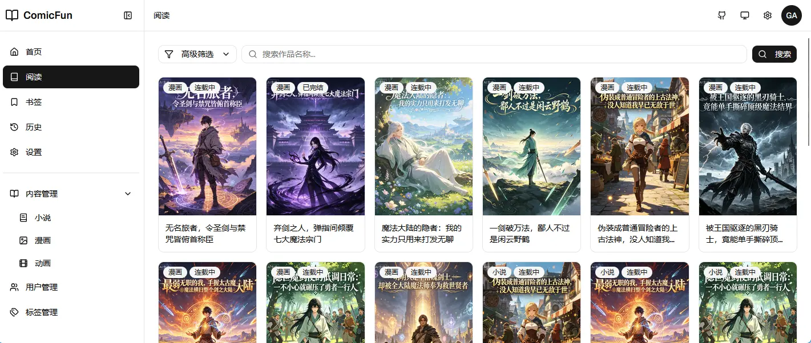

# ComicFun

自托管的轻量级小说、漫画、动画内容管理系统。



## 核心特性

- 登录鉴权：多用户设计，支持公开、私有权限
- 内容管理：小说按`作品-卷-章`维护，漫画按`作品-卷-章-页`维护，动画按`作品-季-话`维护
- 阅读器：小说阅读器支持字号调整、多主题切换，漫画阅读器支持传统模式和条漫模式
- 导出：小说支持txt导出，漫画支持zip / cbz格式导出
- 作品检索：支持按关键字、标签、状态、内容类型检索，支持按发布时间排序
- 阅读进度：支持用户添加书签、自动保存阅读进度
- 响应式前端：支持 PC / iPad / Mobile
- 支持浅色 / 暗色或跟随系统主题切换
- 多语言支持

## 技术栈

- Backend: Gin, GORM, SQLite
- Frontend: React, Vite, Tailwind CSS, shadcn/ui

## 启动开发环境

### 1) 启动前端

```bash
cd frontend && npm install && npm run dev
```

默认前端地址为`http://localhost:5173`（通过Vite的devServer反向代理`/api`到后端）。

### 2) 启动服务端

```bash
go build -tags debug -o ./bin/comicfun ./cmd/server/ && ./bin/comicfun
```

默认服务端地址为`http://localhost:8080`。

## 生产构建与部署

生产构建采用前端资源嵌入二进制可执行文件方式。

```bash
# 1. 构建前端
cd frontend && npm install && npm run build

# 2. 构建后端
go build -o ./bin/comicfun ./cmd/server/

# 3. 启动服务
GIN_MODE=release ./bin/comicfun
```

部署模式下，前端静态文件已嵌入到二进制文件中，服务端会自动处理SPA路由回退，访问`8080`即可打开页面。

注意：必须先构建前端再构建后端，因为 Go embed 要求`frontend/dist`目录在编译时存在。

## 配置说明

配置文件根据环境变量设置加载，`GIN_MODE=release`时默认加载`config/config.prod.yaml`，否则默认加载`config/config.dev.yaml`。此外也可通过环境变量`CONFIG_FILE`指定自定义配置文件路径。

### 配置项示例

```yaml
server:
  host: "0.0.0.0" # 启动绑定IP
  port: 8080 # 启动端口

jwt:
  secret: "change-this-secret-in-production" # JWT加密密钥
  expire_hours: 24 # 凭证过期时间

data:
  path: "data" # 数据存储目录
```
